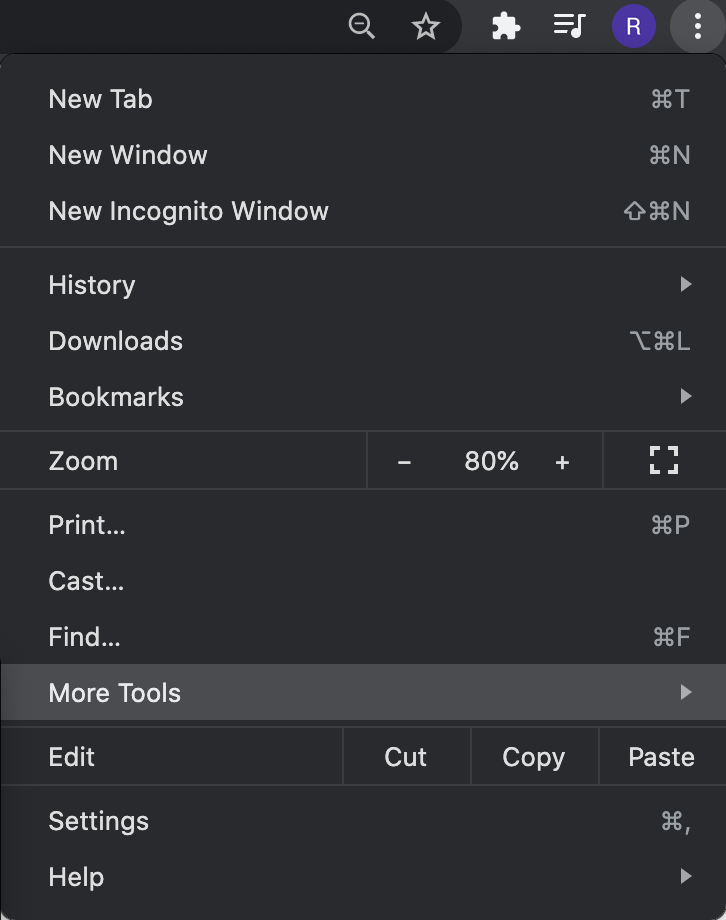
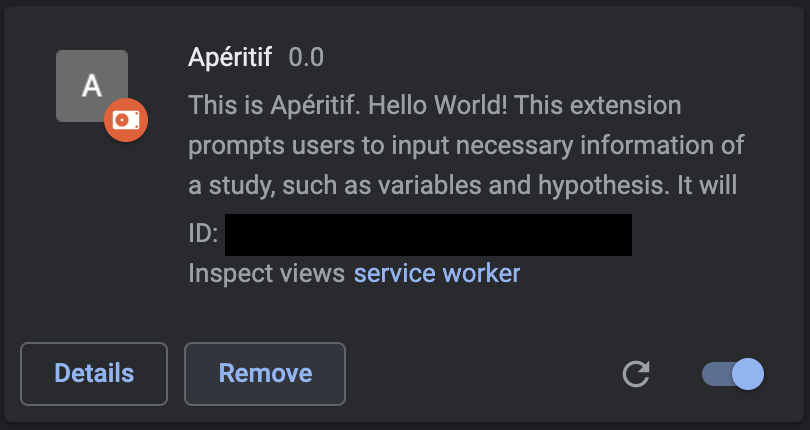

# Apéritif

Apéritif is a Chrome extension that scaffolds your preregistration experience with tipcs for statistical analysis, recommendation for statistical tests, visualization for sample size selection, and code/method generation. (under review) 

This is the repository for Apéritif development. However, please refer to OSF research repository if you are interested in all the supplementary materials for our research paper. If you ran into problems, feel free to open an issue, or email [Anonymnous Author for Review] at [Anonymous author's email].

In this repository, we have the source code for the Chrome extension that works with AsPredicted.org as well as that for the user evaluation website. 

## Backend

* The backend server of Apéritif is in Python with [Flask](https://flask.palletsprojects.com/en/2.0.x/).

* To run the backend server, make sure you have Python 3 and flask installed on your computer. Additionally, you need [tealang](https://tea-lang.org/). 

* You also need to configure your github account with your username, repo, and personal access [token](https://docs.github.com/en/authentication/keeping-your-account-and-data-secure/creating-a-personal-access-token).

* Update both MongoDB and GitHub information in `main.py`


```
source venv/bin/activate

pip install -r requirements.txt

export FLASK_APP=main
flask run

# Alternatively, you can run the command below
# Just make sure your local port is not occupied. 
python main.py 
```

## Install the Chrome Plugin

Clone this repository or download the zip file

### Load the plugin on your Chrome browser

* Click `extensions` under `More Tools` on the top right of your Chrome browser.



* Click `Load unpacked` at the top left of the Extension page. Then select the `extension` folder under the repository/zip file you just downloaded. 



### Use the Plugin on AsPredicted.org

* Create an AsPredicted account if you don't have one.
* Go to https://aspredicted.org/create.php.
* Give access to Apéritif extension on Chrome. 

  
* Start use Apéritif to preregister your first study


## Deploy the website

The website is deployed [here](https://preregistration-experiment.herokuapp.com/) by Heroku. We stored the input data in [MongoDB](https://docs.mongodb.com/guides/server/drivers/). We implemented the website just because users might have concern/conflict with creating a (new) AsPredicted account and downloading unwanted Chrome extension. We simply injected our JS, CSS, HTML code to [AsPredicted](https://aspredicted.org/) interface. The logic are the same in the Chrome extension itself at the `extension` folder. 

#### Start the app locally

```
cd ./website
heroku local:start
```

If you run into issue, please see https://devcenter.heroku.com/articles/heroku-local#run-your-app-locally-using-the-heroku-local-command-line-tool, or contact the author. 

#### Create a Heroku app

You can also deploy our website and see how it works remote, or simply go to our website from above. 

```
heroku create

# Rename is necessary
heroku rename heroku NAME

git push heroku main
```

If you run into any issue, see https://devcenter.heroku.com/articles/git.


## Other

This repository also contains our preregistration on OSF (anonymous for peer review process as it contains author's identifiable information) and AsPredicted (public now). It also contains user survey questions as data analysis code. Please don't hesitate to contact the author (anonynous for peer review) if you need any question.
