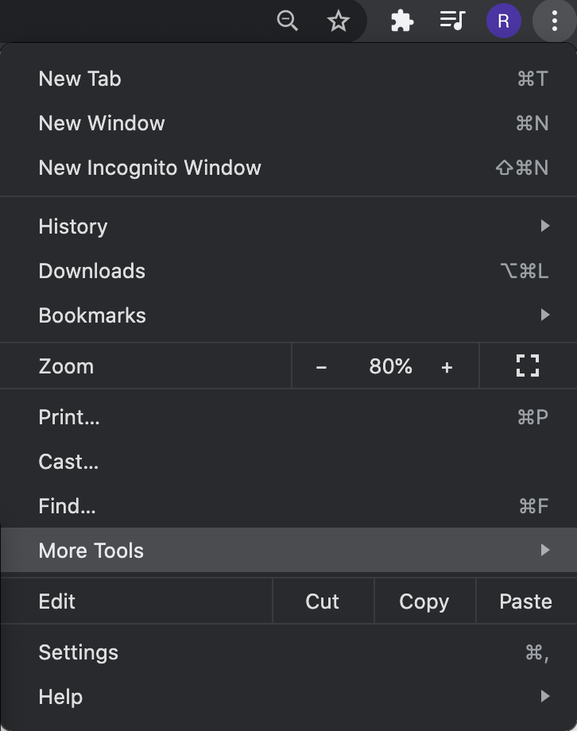
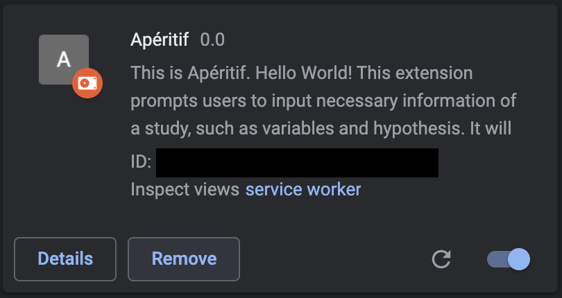

To install the plugin, see [here](https://github.com/rrrrrrockpang/aperitif#install-the-chrome-plugin)

To use the extension, you need to activate the backend server.

## Install the Chrome Plugin

Clone this repository or download the zip file

### Load the plugin on your Chrome browser

* Click `extensions` under `More Tools` on the top right of your Chrome browser.

* Click `Load unpacked` at the top left of the Extension page. Then select the `extension` folder under the repository/zip file you just downloaded. 

### Use the Plugin on AsPredicted.org

* Create an AsPredicted account if you don't have one.
* Go to https://aspredicted.org/create.php.
* Give access to Apéritif extension on Chrome. 

  
* Start use Apéritif to preregister your first study